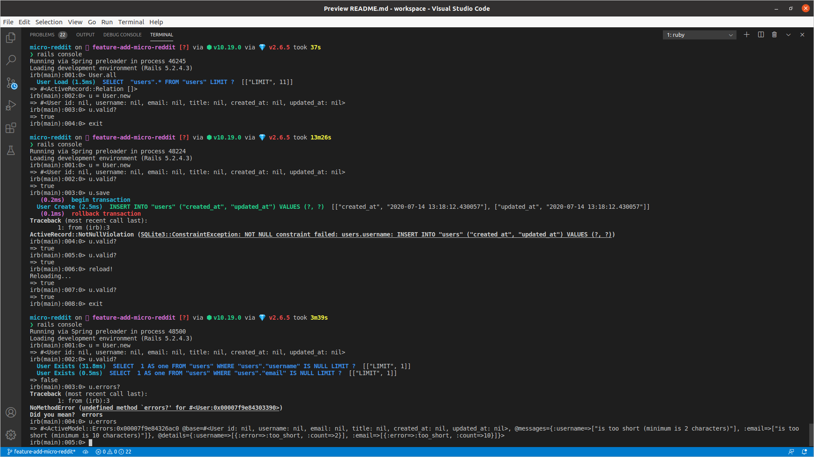

# micro-reddit

This is a project in the Ruby on Rails curriculum at [Microverse](https:www.microverse.org/) - @microverseinc

The project specifications can be found on [Ruby on Rails
PROJECT: BUILDING WITH ACTIVE RECORD](https://www.theodinproject.com/courses/ruby-on-rails/lessons/building-with-active-record-ruby-on-rails)



## Built With
- Ruby
- Rails 

## Description
- This is a project for learning to create data models and associations between models with Active Record in a Rails application.

- The Rails framework was used to build this project.

### Run instructions 
-  You can clone the GitHub repo and type the following commands in the terminal to run the following commands 
    ```
    bundle install
    rake db:migrate
    rails console
    ```

### How to use the site
Enter `rails console` in the terminal
- Enter Active Record commands in the console to check the database models and associations according to the 
[instructions](https://www.theodinproject.com/courses/ruby-on-rails/lessons/building-with-active-record-ruby-on-rails).


## Deployment
- You can deploy on [Heroku](https://devcenter.heroku.com/categories/ruby-support).

## Authors

👤 **Ritta Buyaki**
- Github: [@Buyaki01](https://github.com/Buyaki01)
- Twitter: [ @BuyakiRitta](https://twitter.com/BuyakiRitta)
- Linkedin: [Ritta Buyaki](https://www.linkedin.com/in/ritta-buyaki-b12904128/)

👤 **Marylene Sawyer**
- Github: [@Bluette1](https://github.com/Bluette1)
- Twitter: [@MaryleneSawyer](https://twitter.com/MaryleneSawyer)
- Linkedin: [Marylene Sawyer](https://www.linkedin.com/in/marylene-sawyer)


# Acknowledgements
- [Edge Guides](https://edgeguides.rubyonrails.org/)


## 🤝 Contributing

Contributions, issues and feature requests are welcome!

Feel free to check the [issues page](https://github.com/Bluette1/micro-reddit/issues).

## Show your support

Give a ⭐️ if you like this project!

## 📝 License

This project is [MIT](https://opensource.org/licenses/MIT) licensed.
